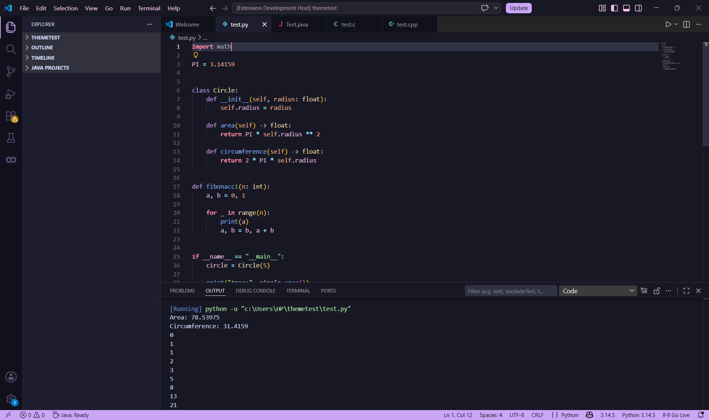
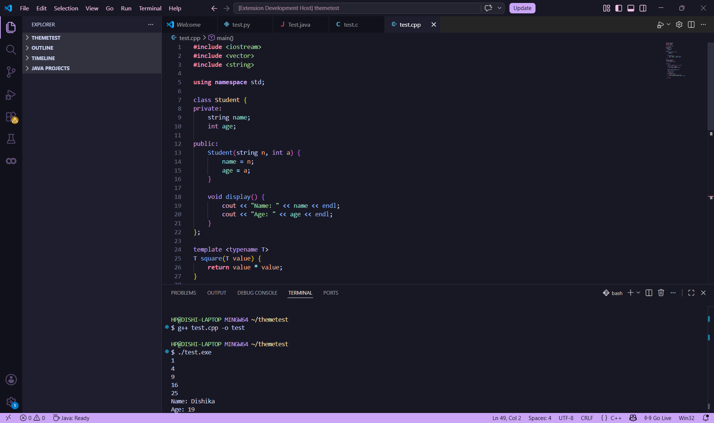

# VioletSky

A dreamy pastel dark VS Code theme inspired by lavender nights and violet clouds.

---

# gng i will be back after i get that azure pat ts pmo oh my god bless this

## Features

- 🌙 Soft pastel syntax highlighting
- 💜 Lavender-inspired UI accents
- 🪻 Semantic token highlighting support
- 🌌 Comfortable contrast for long coding sessions
- 💻 Designed for Python, C, C++, Java, JSON, and Markdown

---

## Preview

### Python

### C++

---

## Installation

1. Open Extensions in VS Code
2. Search for `VioletSky`
3. Click Install
4. Select the VioletSky theme

---

## Recommended Font

- JetBrains Mono
- Cascadia Code
- Fira Code

---

## License

MIT License © 2026 Dishika 
